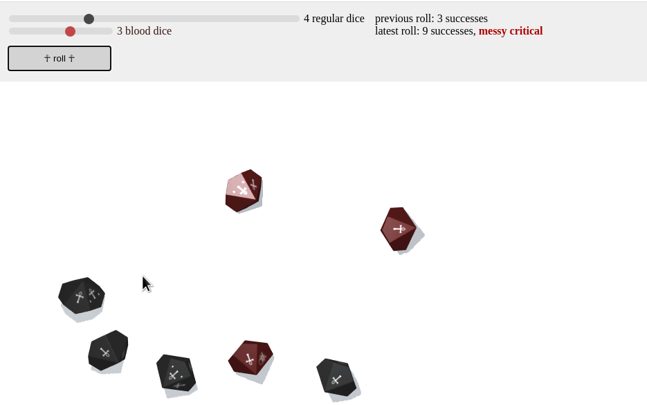

# :vampire: vampire-dice-roller :vampire:

A dice roller for the [Vampire the Masquerade](https://www.modiphius.net/collections/vampire-the-masquerade) tabletop role-playing game.

## Features

- 3D dice rolling with realistic physics
- Support for both regular and hunger dice pools
- Modern, responsive UI with smooth animations
- Discord integration for sharing roll results
- Mobile-friendly design with touch support
- Offline-first functionality
- Beautiful visual effects for critical successes and failures

## Installation

To use the roller, download [the latest release zip](https://github.com/prncc/vampire-dice-roller/archive/v1.0.zip), extract it anywhere, and double click on `vampire-dice-roller.html` to open the app.

## Usage

### Basic Rolling
- Select the number of regular dice (up to 20) using the slider in the upper left corner
- Select the number of hunger dice (up to 5) using the second slider
- Roll by either:
  - Dragging across the white canvas
  - Clicking the "Roll" button
  - Pressing Enter or Space
- Results are displayed in the upper right corner, showing:
  - Number of successes
  - Critical successes (when applicable)
  - Messy criticals (when applicable)
  - Bestial failures (when applicable)

### Discord Integration
1. Click the "Discord Settings" button
2. Enter your Discord webhook URL
3. (Optional) Enter your character's name
4. Click "Save" to store your settings
5. All future rolls will be automatically posted to your Discord channel
6. Use the "Clear" button to remove Discord integration

### Mobile Usage
- The interface automatically adapts to mobile screens
- Touch-friendly controls for dice selection
- Smooth animations optimized for mobile devices
- Haptic feedback on supported devices

## Development

This is a modification of Andre Perunicic's [Vampire Dice Roller](https://github.com/prncc/vampire-dice-roller) based on Anton Natarov's [teal 3d dice roller](http://a.teall.info/dice/).
Thanks to Andre and Anton for sharing their code!

### Key Improvements
- Added support for Vampire: The Masquerade's dice system
- Implemented modern UI with responsive design
- Added Discord integration for remote play
- Enhanced visual feedback for roll results
- Optimized for mobile devices
- Added touch support and haptic feedback
